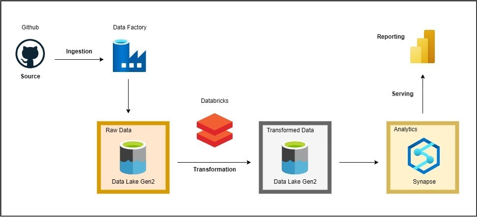

## AdventureWorks-Data-Engineering

### 📌 Project Overview
This project demonstrates a **modern data engineering pipeline** built on **Azure** using the **AdventureWorks dataset**. The pipeline follows the **Medallion architecture** (Bronze, Silver, Gold) and integrates multiple Azure services to process, transform, and analyze data efficiently.

### 📊 Architecture & Workflow

1. **Data Ingestion**
   - Source: **AdventureWorks Dataset**
   - Storage: **Azure Data Lake Storage (ADLS) - Bronze Layer**
   - Ingestion Tool: **Azure Data Factory (ADF)**

2. **Data Processing & Transformation**
   - **Silver Layer**: Cleaned and structured data stored in ADLS.
   - **Gold Layer**: Aggregated and optimized data for reporting.
   - **Processing Engine**: **Azure Databricks (PySpark)** for transformations.

3. **Data Warehousing & Analytics**
   - Data loaded into **Azure Synapse Analytics** for querying and reporting.

4. **Serving & Visualization**
   - Final dataset served for visualization.

### 🛠️ Technologies Used
- **Azure Data Factory (ADF)** → Orchestration & ETL
- **Azure Data Lake Storage (ADLS)** → Staging & Medallion Architecture
- **Azure Databricks (PySpark)** → Data Processing
- **Azure Synapse Analytics** → Data Warehousing
